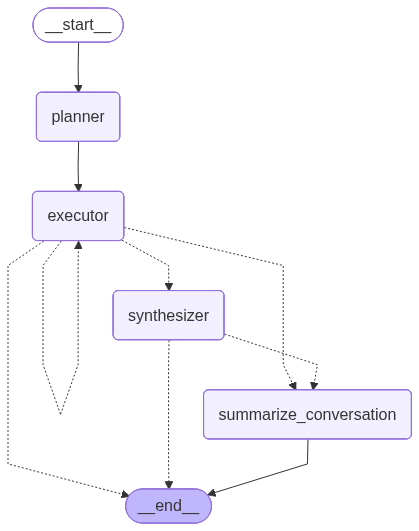
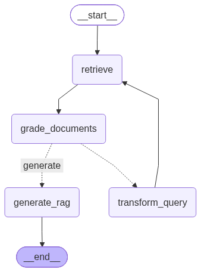

# Mister Fritz - Discord AI Chatbot

Mister Fritz is an AI-powered Discord bot with a sophisticated, sardonic personality modeled after an English butler. The bot uses LangChain, LangGraph, and Ollama to provide conversational responses with memory retention, web search capabilities, and document retrieval.

## Features

- **Conversational AI**: Witty, butler-like responses powered by local LLM models via Ollama
- **Memory System**: Stores and retrieves conversation summaries per user using ChromaDB
- **Document Search**: RAG (Retrieval-Augmented Generation) system for querying local documents (Word docs & PDFs)
- **Web Integration**: Can search the web and scrape websites for information
- **Image Generation**: Text-to-image generation using Stable Diffusion XL with support for long prompts (bypasses 77 token limit)
- **Discord Commands**:
  - `$hello` - Greet the bot
  - `$lore <query>` - Search local documents
  - `$gen <prompt>` - Generate images from text descriptions
  - `$join` / `$leave` - Joins the current voice channel the user is in
  - `$voice <query>` - Triggers conversational responses. If the bot is in a voice channel, it will speak the message, otherwise it will attach an audio file.
  - Direct messages or mentions trigger conversational responses that can use any of the below tools. You can also upload a voice message using Discord mobile as well.
- **Tools**: Dice rolling, current time lookup, web search, document search, memory retrieval, image generation, and image recognition (limited to one attachment per message)

## Architecture

The bot uses a LangGraph-based agent system with:
- **Conversation Node**: Handles user queries with tool access
- **Summarization Node**: Automatically summarizes long conversations and stores memories
- **SQLite Checkpointing**: Persists conversation state
- **ChromaDB**: Stores user memories and document embeddings
- **Image Generation Pipeline**: Uses Stable Diffusion XL with custom prompt encoding to bypass the 77 token limit, supporting very long and detailed prompts

Basic Conversation Diagram:



Document Engine Diagram:



## Prerequisites

### 1. Install Python
- Python 3.12+ is recommended
- Download from [python.org](https://www.python.org/downloads/)

### 2. Install PyTorch with CUDA Support (Optional but Recommended)

For GPU-accelerated image generation, install PyTorch with CUDA support before installing other dependencies:

**Windows/Linux with CUDA:**
```bash
pip install torch torchvision torchaudio --index-url https://download.pytorch.org/whl/cu121
```

**macOS or CPU-only:**
```bash
pip install torch torchvision torchaudio
```

### 3. Install Ollama

**Windows:**
1. Download the Ollama installer from [ollama.com](https://ollama.com/download/windows)
2. Run the installer and follow the prompts
3. Ollama will run as a background service

**macOS:**
```bash
# Using Homebrew
brew install ollama

# Or download from ollama.com/download/mac
```

**Linux:**
```bash
curl -fsSL https://ollama.com/install.sh | sh
```

### 4. Pull Required Ollama Models

After installing Ollama, pull the models used by Mister Fritz:

Windows:

Run ./modelfiles/run.bat

Linux/macOS:

```bash
ollama create -f .\gpt-oss-20b-modelfile.txt gpt-oss
ollama create -f .\llama3.2-modelfile.txt llama3.2
ollama create -f .\llava-modelfile.txt llava

ollama run gpt-oss /bye
ollama run llama3.2 /bye
ollama run llava /bye

ollama pull mxbai-embed-large
```


## Installation

1. **Clone the repository:**
```bash
git clone <repository-url>
cd MisterFritz
```

2. **Create a virtual environment:**
```bash
python -m venv .venv
```

3. **Activate the virtual environment OR install with pip:**

Virtual environment:

Windows:
```bash
.venv\Scripts\activate
```

macOS/Linux:
```bash
source .venv/bin/activate
```

Pip installation:

```bash
pip install -r requirements.txt
```

4. **Configure the bot:**

Create a `config.json` file in the project root with the following structure:
```json
{
  "discord_bot_token": "YOUR_DISCORD_BOT_TOKEN",
  "doc_storage_description": "Description of what documents contain (e.g., 'The world of Sennen or Dungeons and Dragons')"
}
```

To get a Discord bot token:
1. Go to [Discord Developer Portal](https://discord.com/developers/applications)
2. Create a new application
3. Go to the "Bot" section
4. Click "Reset Token" to generate a token
5. Enable "Message Content Intent" under Privileged Gateway Intents
6. Invite the bot to your server using the OAuth2 URL generator

6. **Set up document folder (optional):**

Create an `input/` directory and add files for the RAG system:
```bash
mkdir input
# Add your documents to this folder
```

## Running the Bot

1. **Start Ollama** (if not already running):
```bash
ollama serve
```

2. **Run the Discord bot:**
```bash
python main_discord.py
```

The bot will:
- Connect to Discord
- Initialize the vector store for document search
- Begin responding to messages and commands

### Docker Compose (Ollama)

You can optionally run Ollama via Docker Compose (auto-initializes models on first run):

```bash
docker compose up -d
```

Then run the bot locally with `python main_discord.py`.

## Usage Examples

**Direct conversation:**
```
@Botname What's the weather like today?
```

**Search documents:**
```
$lore Tell me about the kingdom of Sennen
```

**Roll dice:**
```
@Botname roll 2d20
```

**Web search:**
```
@Botname What's the latest news about AI?
```

**Generate images:**
```
$gen a majestic dragon flying over a medieval castle at sunset, highly detailed, fantasy art
```

The bot can also generate images through conversation when mentioned:
```
@Botname can you create an image of a cyberpunk cityscape with neon lights?
```

## Troubleshooting

**"Ollama connection refused":**
- Ensure Ollama is running with `ollama serve`
- Check if models are installed with `ollama list`

**"No documents found":**
- Verify documents are in the `input/` folder
- Supported formats: `.docx`, `.pdf`

**Discord bot not responding:**
- Verify the bot token in `config.json`
- Ensure "Message Content Intent" is enabled in Discord Developer Portal
- Check bot permissions in your Discord server

**OCR not working for PDFs:**
- Install optional dependencies: `pip install easyocr PyMuPDF pillow`

**Image generation is slow or fails:**
- For GPU acceleration, ensure CUDA is installed and PyTorch detects your GPU
- Check GPU availability: `python -c "import torch; print(torch.cuda.is_available())"`
- The first image generation will download the Stable Diffusion XL model (~7GB)
- CPU generation is supported but significantly slower
- xformers is used for memory-efficient attention on compatible systems

## License

See repository for license information.

## Contributing

Contributions are welcome! Please open an issue or pull request.
